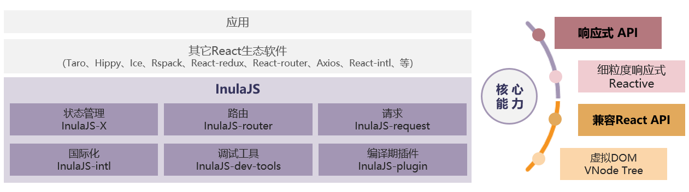

# lnulaJS开源项目

## 项目介绍

lnula（发音为：[ˈɪnjʊlə]）。InulaJS 是一款用于构建用户界面的 JavaScript 库，提供响应式 API 帮助开发者简单高效构建 web 页面，比传统虚拟 DOM 方式渲染效率提升30%以上！同时 InulaJS 提供与 React 保持一致的 API，并且提供5大常用功能丰富的核心组件：状态管理器、路由、国际化、请求组件、应用脚手架，以便开发者高效、高质量的构筑基于 InulaJS 的前端产品。

## 技术架构

### 核心能力

**响应式API**

* InulaJS通过最小化重新渲染的范围，从而进行高效的UI渲染。这种方式避免了虚拟DOM的开销，使得InulaJS在性能方面表现出色。
* InulaJS通过比较变化前后的JavaScript对象以细粒度的依赖追踪机制来实现响应式更新，无需用户过度关注性能优化。
* 简洁API：
  1. InulaJS提供了两组简洁直观的API--响应式API和与React一致的传统API，使得开发者可以轻松地构建复杂的交互式界面。
  2. lnulaJS简洁的API极大降低了开发者的学习成本，开发者使用响应式API可以快速构建高效的前端界面。

**兼容ReactAPI**

* 与React保持一致API的特性、可以无缝支持React生态。
* 使用传统API可以无缝将React项目切换至lnulaJS，React应用可零修改切换至lnulaJS。

### lnulaJS配套组件

**状态管理器/lnulaJS-X**
lnulaJS-X是lnulaJS默认提供的状态管理器，无需额外引入三方库，就可以简单实现跨组件/页面共享状态。
lnulaJS与Redux比可创建多个Store，不需要在Reducer中返回state并且简化了Action和Reducer的创建步骤，原生支持异步能力，组件能做到精准重渲染。lnulaJS-X均可使用函数组件、class组件，能提供redux的适配接口及支持响应式的特点。

**路由/lnulaJS-router**
lnulaJS-router 是lnulaJS生态组建的一部分，为lnulaJS提供前端路由的能力，是构建大型应用必要组件。
lnulaJS-router涵盖react-router、history、connect-react-router的功能。

**请求/lnulaJS-request**
inulaJS-request是InulaJS生态组件，涵盖常见的网络请求方式，并提供动态轮询钩子函数给用户更便捷的定制化请求体验。

**国际化/lnulaJS-intl**
lnulaJS-intl是基于lnulaJS生态组件，其主要提供了国际化功能，涵盖了基本的国际化组件和钩子函数，便于用户在构建国际化能力时方便操作。

**调试工具/lnulaJS-dev-tools**
lnulaJS-dev-tools是一个为InulaJS开发者提供的强大工具集，能够方便地查看和编辑组件树、管理应用状态以及进行性能分析，极大提高了开发效率和诊断问题的便捷性。

**脚手架/lnulaJS-cli**
lnulaJS-plugin是一套针对InulaJS的编译期插件，它支持代码优化、JSX语法转换以及代码分割，有助于提高应用的性能、可读性和可维护性。

## InulaJS文档

欢迎访问lnulaJS文档仓库，参与lnulaJS开发者文档开源项目，与我们一起完善开发者文档。
此仓库存放lnulaJS网站提供的设备开发、应用开发对应的开发者文档。

[访问官网](https://www.inulajs.org/)
[lnulaJS快速入门](https://gitee.com/inula-js/docs/blob/master/%E5%BF%AB%E9%80%9F%E5%85%A5%E9%97%A8.md)
[lnulaJS深度指南](https://wiki.huawei.com/domains/30751/wiki/49494/WIKI202307041459419)

## 代码仓地址

InulaJS仓库地址：[https://gitee.com/inula-js](https://gitee.com/inula-js)

## 如何参与

**参与贡献**
欢迎您参与[贡献](https://gitee.com/inula-js/docs/blob/master/%E8%B4%A1%E7%8C%AE%E6%8C%87%E5%8D%97.md)，我们鼓励开发者以各种方式参与文档反馈和贡献。

您可以对现有文档进行评价、简单更改、反馈文档质量问题、贡献您的原创内容，详细请参考[贡献文档](https://gitee.com/inula-js/docs/blob/master/%E8%B4%A1%E7%8C%AE%E6%8C%87%E5%8D%97.md)。

## 许可协议

InulaJS主要遵循Mulan Permissive Software License v2协议，详情请参考各代码仓LICENSE声明。

## 联系方式

team@inulajs.org

